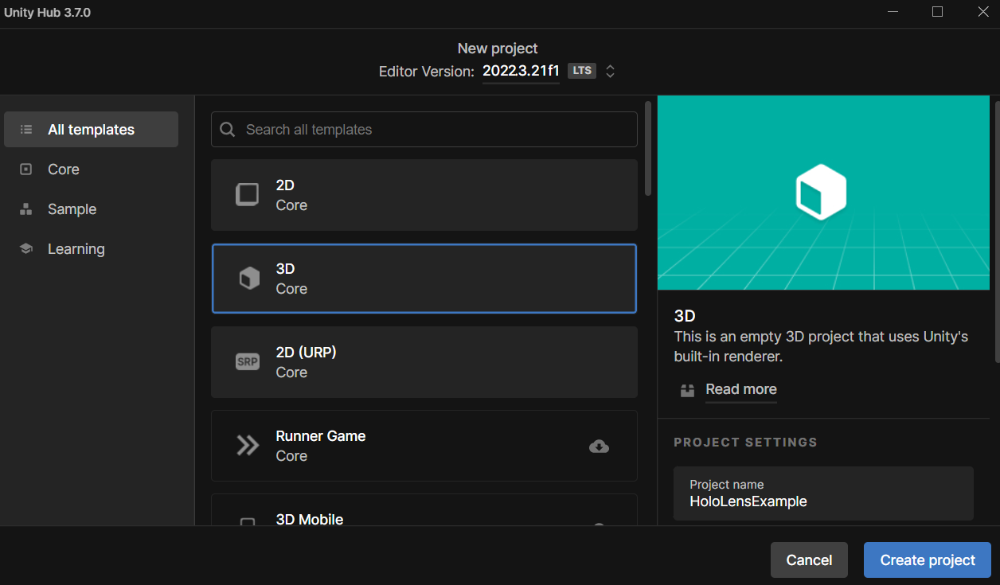

# Développer avec HoloLens 2 sur Unity

***

Maintenant que nous avons pris le casque de réalité mixte en mains, nous pouvons commencer à préparer notre environnement de développement.

## Création du projet Unity

Nous allons en premier lieu créer un projet Unity. Il est important que la version d’Unity soit la **2021.3.35f1** afin d’éviter tout problème de compatibilité avec les packages MRTK. Il faut donc créer un projet 3D vierge. Le nom du projet importe peu.

<figure markdown="span">
    
    <figcaption>Création d'un projet 3D sur Unity</figcaption>
</figure>

Une fois notre projet Unity créé, Nous allons nous diriger vers `File` &rarr; `Build Settings`, puis changer la plateforme pour `Universal Windows Platform`. Ensuite, nous pouvons fermer l’éditeur et passer à l’installation du **Mixed Reality Feature Tool (MRTK)**.

## Mixed Reality Feature Tool

Le Mixed Reality Feature Tool, ou MRTK, est une librairie permettant aux développeurs de programmer plus facilement leurs applications pour les casques de réalité mixte. Il est disponible pour Unreal et Unity. Dans notre cas, nous utiliserons Unity. 

!!! info

    Vous pouvez suivre le guide [ici](https://learn.microsoft.com/fr-fr/windows/mixed-reality/develop/unity/new-openxr-project-with-mrtk).