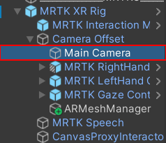

# Installer Vuforia sur le projet Unity

***

## Pourquoi installer Vuforia ?

Pour pouvoir détecter nos machine grâce à la camera du casque HoloLens 2, il nous faut utiliser le package [Vuforia](https://developer.vuforia.com/). Ce package permettra de détecter n'importe quel objet dans le monde réel grâce à son modèle 3D.

## Inscription et téléchargement du paquet Vuforia

En premier lieu, il vous faudra un compte pour utiliser Vuforia. Pour créer un compte, rendez-vous sur [le site web de Vuforia](https://developer.vuforia.com/). Ensuite, cliquez sur `Register`. Remplissez le formulaire et inscrivez-vous.

<figure markdown="span">
    
    <figcaption>Page d'accueil de Vuforia</figcaption>
</figure>

Un fois votre compte créé, connectez-vous et cliquez sur l'onglet `Downloads`. Ensuite, cliquez sur 
`Add Vuforia Engine to a Unity Project or upgrade to the latest version`. Enregistrez le fichier.

<figure markdown="span">
    
    <figcaption>Page de téléchargement de Vuforia</figcaption>
</figure>

Un fois le paquet téléchargé, glissez-le dans votre projet Unity. Une fenêtre devrait s'ouvrir. Cliquez sur le bouton `Import`.

## Configuration de Vuforia

Une fois que Vuforia est installé sur le moteur, il reste quelques étapes. La première étape est d'installer le script de Vuforia sur notre caméra MR.

Pour faire cela, développez le `MRTK XR Rig`, puis développez `Camera Offset`. Enfin sélectionnez `Main Camera`.

<figure markdown="span">
    
    <figcaption>Zoom sur l'éditeur Unity</figcaption>
</figure>

Dans les composants de la caméra, ajoutez les scripts suivants :

* Vuforia Behavior
* Default initialization Error Handler

<figure markdown="span">
    
    <figcaption>Scripts à ajouter à la caméra</figcaption>
</figure>

Maintenant que vous avez ajouté ces scripts à votre caméra, retournez sur la page web de Vuforia.
Cliquez sur `My Account`, puis sur `Licenses`, et enfin sur `Get Basic`.

<figure markdown="span">
    
    <figcaption>Page de License de Vuforia</figcaption>
</figure>

Ensuite, donnez un nom à votre license Vuforia. Après avoir lu le contrat de développeur Vuforia et avoir accepté les conditions, cliquez sur `Confirm`.

<figure markdown="span">
    
    <figcaption>Page de création de license de Vuforia</figcaption>
</figure>

Une fois votre license créée, le site vous redirigera sur la page `Licenses` de Vuforia. Faites un double-clique sur le nom de la license que vous venez de créer et copiez la clé de license.

<figure markdown="span">
    
    <figcaption>Page contenant la clé de license</figcaption>
</figure>

Une fois votre clé copiée, retournez sur Unity. Dans le script Vuforia Behavior qui est dans votre caméra, cliquez sur `Open Vuforia Engine Configuration`. Dans l'inspecteur, cherchez une boite avec `App License Key`. Collez votre clé dans cette boîte.

<figure markdown="span">
    
    <figcaption>Instructions à suivre pour insérer la clé de license</figcaption>
</figure>

!!! info

    Pour plus d'informations, vous pouvez également consulter la vidéo suivante :

    <iframe width="100%" height="415" src="https://www.youtube.com/embed/o0ybVu9SB7g?si=8QoKSIvS6W-GcaDT" title="YouTube video player" frameborder="0" allow="accelerometer; autoplay; clipboard-write; encrypted-media; gyroscope; picture-in-picture; web-share" allowfullscreen></iframe>