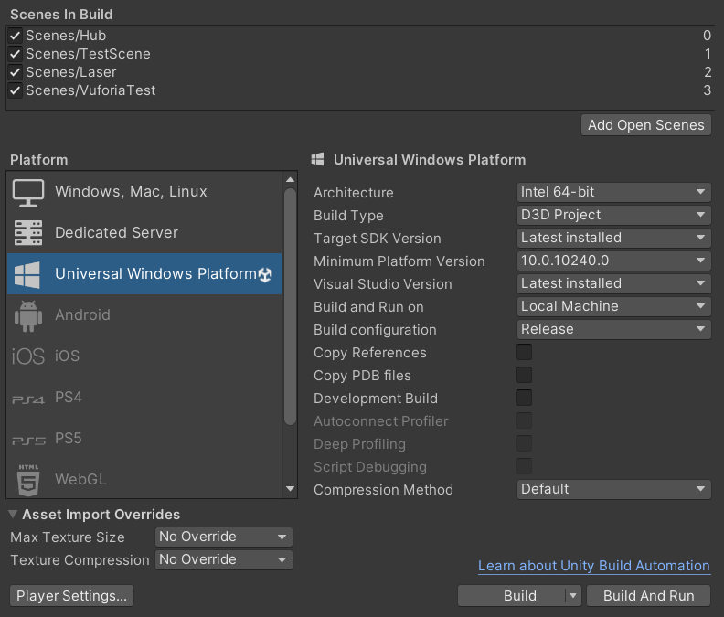
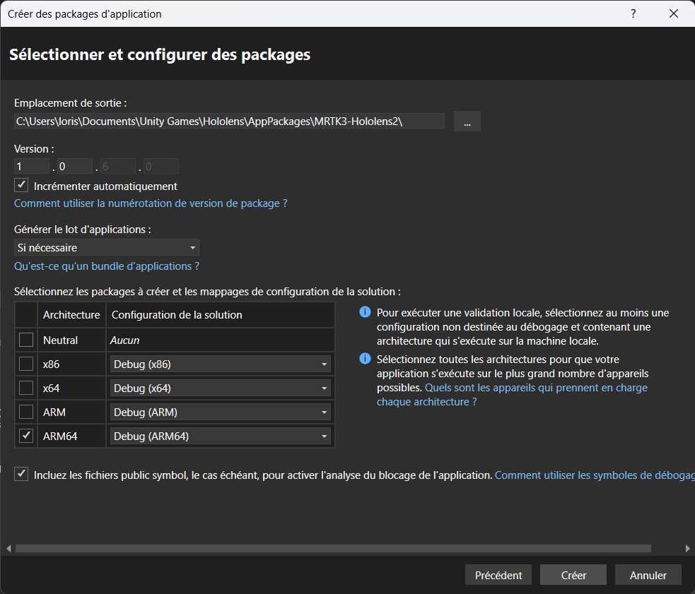

# Build son projet et le déployer sur le casque HoloLens

***

Build votre projet sur le casque HoloLens vous permet de le lancer directement sur le casque en tant qu'application, et cela permet aussi à votre projet d'accéder aux caméras du casque.

## Activer le mode développeur

### Sur HoloLens

### Sur Windows 10

Rendez-vous dans les Paramètres, puis allez dans `Mise à jour et sécurité` &rarr; `Espace développeurs` et activez `Mode développeur`.

### Sur Windows 11

Rendez-vous dans les Paramètres, puis allez dans `Système` &rarr; `Espace développeurs` et activez `Mode développeur`.

## Build le projet sur Unity

Pour build votre projet avec Unity, allez dans `File` &rarr; `Build settings...`, vous pouvez y accéder vie le raccourcis `Ctrl + Shift + B`.

!!! warning "Important"

    Pensez à ajouter vos scène en appuyant sur le bouton `Add Open Scenes` en étant sur la scène que vous voulez ajouter.

<figure markdown="span">
    
    <figcaption>Build du projet sur Unity</figcaption>
</figure>

Si vous n'êtes pas déjà sur la bonne plateforme, choisisez la plateforme `Universal Windows Platefrom` et cliquez sur `Switch platefrom`. Une fois fait, mettez les mêmes paramètres que sur l'image. Une fois tout cela fait, vous pouvez build le projet en appuyant sur le bouton `Build`

## Publier le projet avec Visual Studio

Une fois votre build finis, ouvrez le fichier `[NomDeVotreProjet].sln` avec Visual Studio. Sur la droite de votre fenêtre Visual Studio, faites un clique droit sur `[NomDeVotreProjet] (Universal Windows)` et cliquez sur `Publier` &rarr; `Créer des packages d'applications...`

<figure markdown="span"></figure>

<figure markdown="span"></figure>

Vous aurez une nouvelle fenêtre qui souvrira, les 2 premières étapes il n'y a rien à modifier, mais pour la dernière, mettez les mêmes modifications que sur l'image ci-dessous :

<figure markdown="span"></figure>

Une fois cela fait, appuyez sur `Créer`, cela va vous créer des fichiers permettants de déployer votre projet sur le casque HoloLens.

## Déployer le projet sur le casque