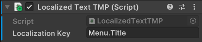

# Ajout d'un paquet permettant de changer la langue de l'application

***

!!! info

    Cette partie n'est pas obligatoire pour le développement de logiciels avec HoloLens, mais permet d'avoir plusieurs languages disponibles sur votre application.

## Installation du paquet Simple Localization with Google Sheets

Pour commencer, ouvrez votre projet Unity si ce n'est pas déjà fait. Ensuite, ouvrez une page internet et collez le lien suivant : [https://assetstore.unity.com/packages/tools/gui/simple-localization-with-google-sheets-120113](https://assetstore.unity.com/packages/tools/gui/simple-localization-with-google-sheets-120113)

Cliquez sur `Add to My Assets` 

<figure markdown="span">
    
    <figcaption>Page du paquet de localisation</figcaption>
</figure>

Pour continuer, vous devrez vous connecter à votre compte Unity. Une fois la connexion terminée, vous allez être redirigé à nouveau vers la page du paquet. Cliquez sur `Open in Unity`.

<figure markdown="span">
    
    <figcaption>Page du paquet de localisation</figcaption>
</figure>

Une fenêtre devrait s'ouvrir en haut de votre page vous demander d'autoriser l'accès à Unity. Cliquez sur `Ok`.
De retour sur unity, une fenêtre nommée **Package Manager** a du s'ouvrir. Sélectionnez le bon paquet et cliquez sur `Download`.
Une fois le paquet téléchargé, cliquez sur `Import`.

<figure markdown="span">
    
    <figcaption>Fenêtre du Package Manager</figcaption>
</figure>

Une nouvelle fenêtre devrait également s'ouvrir avec les information du paquet. Cliquez à nouveau sur `import`.

<figure markdown="span">
    
    <figcaption>Fenêtre d'import du paquet</figcaption>
</figure>

Maintenant, vous pouvez vous rendre dans le dossier `SimpleLocalization`, puis ouvrir la scène `Example`. Si le paquet est importé correctement, l'exemple devrait fonctionner.

<figure markdown="span">
    
    <figcaption>Chemin d'accès à la scène d'exemple.</figcaption>
</figure>

## Personnaliser les textes en fonction de la langue

Maintenant que nous avons installé le paquet, nous pouvons passer à la personnalisation des textes que nous voulons traduire.
Pour cela, il faut créer un document Google Sheets. Si vous ne savez pas utiliser Google Sheets, de l'aide est disponible [ici](https://support.google.com/docs/answer/6000292?hl=fr&co=GENIE.Platform%3DDesktop)

Dans le cadre de notre projet, nous utiliserons le document suivant : [Lien vers le document](https://docs.google.com/spreadsheets/d/1xfL971gDXXS4rqXUoYytgwJEXiCeQBecHuoCRmkeasQ/edit#gid=0).

Comme vous pouvez le voir, il y a une certaine mise en forme à respecter. Dans la colonne A, il faut renseigner les clés qui nous servirons de références dans l'éditeur. Dans la ligne 1, vous devez renseigner Key en A1, puis les langues que vous voulez implémenter dans votre projet. 

<figure markdown="span">
    
    <figcaption>Exemple de document valide.</figcaption>
</figure>

Une fois que vous avez rempli le document avec les valeurs que vous souhaitez, cliquez sur `Partager`.

<figure markdown="span">
    
    <figcaption>Page Google Sheets contenant le bouton partager</figcaption>
</figure>

Ensuite, dans Accès général, cliquez sur `Limité` pour le remplacer par `Tous les utilisateurs qui ont le lien`. Passez ces utilisateurs en `Lecteur`.

<figure markdown="span">
    
    <figcaption>Gestion des accès</figcaption>
</figure>

Maintenant, il vous faut l'identifiant du document. Pour cela, récupérez la suite de caractères qui se situe entre d/ et /edit et copiez-la. 

<figure markdown="span">
    
    <figcaption>Partie du lien à copier</figcaption>
</figure>

Retournez sur Unity. allez dans `Window > Simple Localization > Settings`.

<figure markdown="span">
    
    <figcaption>Option à sélectionner</figcaption>
</figure>

Dans la fenêtre qui s'ouvre, collez votre Id dans `Table Id`, puis cliquez sur `Resolve Sheets`. Enfin, après le chargement terminé, sur `Download Sheets`.

<figure markdown="span">
    
    <figcaption>Paramètres à rentrer</figcaption>
</figure>

Maintenant, Nous allons ajouter un script `LocalizedTextTMP` pour pouvoir cha,ger le TextMeshPro de manière dynamique. Pour cela, allez dans `Assets > SimpleLocalization > Scripts`, créez un nouveau script `LocalizedTextTMP.cs` et copiez le code suivant :

```C#
using TMPro;
using UnityEngine;

namespace Assets.SimpleLocalization.Scripts
{
    /// <summary>
    /// Localize text component.
    /// </summary>
    [RequireComponent(typeof(TMP_Text))]
    public class LocalizedTextTMP : MonoBehaviour
    {
        public string LocalizationKey;

        public void Start()
        {
            Localize();
            LocalizationManager.OnLocalizationChanged += Localize;
        }

        public void OnDestroy()
        {
            LocalizationManager.OnLocalizationChanged -= Localize;
        }

        public void Localize()
        {
            TMP_Text textMesh = GetComponent<TMP_Text>();
            switch (LocalizationManager.Language)
            {
                case "Chinese":
                    textMesh.font = MultiLangageManager.instance.chineseFont;
                    break;
                case "Japanese":
                    textMesh.font = MultiLangageManager.instance.japaneseFont;
                    break;
                case "Arabic":
                    textMesh.font = MultiLangageManager.instance.arabicFont;
                    break;
                default:
                    textMesh.font = MultiLangageManager.instance.defaultFont;
                    break;
            }
            textMesh.text = LocalizationManager.Localize(LocalizationKey);
            
        }
    }
}
```

Il faut ensuite implémenter la localisation à notre scène. Dans notre cas, on utilisera la scène `Hub` pour changer la langue.

Dans le dossier `Assets > Scripts`, créez un nouveau script. Nommez-le comme vous voulez mais notez qu'il s'agit d'un manager.

Par exemple, le code de notre Manager ressemble à ceci :

```c#
using Assets.SimpleLocalization.Scripts;
using TMPro;
using UnityEngine;

public class MultiLangageManager : MonoBehaviour
{
    // On importe les différentes polices d'écriture
    public TMP_FontAsset defaultFont;
    public TMP_FontAsset japaneseFont;
    public TMP_FontAsset arabicFont;
    public TMP_FontAsset chineseFont;

    // On crée une instance de MultiLangageManager
    public static MultiLangageManager instance;
    public void Awake()
    {
        if (instance == null)
        {
            instance = this;
        }
        else
        {
            Destroy(gameObject);
        }
        
        // On récupère la langue du système
        LocalizationManager.Read();
        
        
        // On change la langue en fonction de la langue du système
        switch (Application.systemLanguage)
        {
            case SystemLanguage.German:
                LocalizationManager.Language = "German";
                break;
            case SystemLanguage.Japanese:
                LocalizationManager.Language = "Japanese";
                break;
            case SystemLanguage.French:
                LocalizationManager.Language = "French";
                break;
            case SystemLanguage.Spanish:
                LocalizationManager.Language = "Spanish";
                break;
            case SystemLanguage.Arabic:
                LocalizationManager.Language = "Arabic";
                break;
            case SystemLanguage.Chinese:
                LocalizationManager.Language = "Chinese";
                break;
            case SystemLanguage.Italian:
                LocalizationManager.Language = "Italian";
                break;
            case SystemLanguage.Ukrainian:
                LocalizationManager.Language = "Ukrainian";
                break;
            case SystemLanguage.English:
                LocalizationManager.Language = "English";
                break;
            default:
                // Si la langue du système n'est pas reconnue, on met la langue en anglais
                LocalizationManager.Language = "English";
                break;
        }
        
    }
    
    // On crée une fonction pour changer la langue
    public void SetLocalization(string localization)
    {
        LocalizationManager.Language = localization;
    }
}
```

Créez un objet vide sur votre scène, et ajoutez-lui le script que vous venez de créer. Vous devrez renseigner les polices pour les différent langages. Dans notre projet, nous gérons 4 polices : Alphabet latin et cyrillique, Japonais, Chinois et Arabe.

Maintenant que tout est presque fonctionnel, il suffit d'ajouter un nouvel objet vide, lui ajouter le composant `TextMeshPro` et le script `LocalizedTextTMP`. Dans LocalizedTextTMP, rentrez la clé correspondante à celle du document Google Sheets.

<figure markdown="span">
    
    <figcaption>Clé a récupérer</figcaption>
</figure>

<figure markdown="span">
    
    <figcaption>Clé a rentrer dans le composant</figcaption>
</figure>

Une fois toutes les étapes précédentes réalisées, le texte de vore TextMeshPro doit afficher le texte correspondant à la clé donnée et au langage de votre système.

## Changer la langue

Il est possible que l'utilisateur souhaite une langue qui n'est pas celle de son système. Dans ce cas, vous pouvez créer des bouttons, ou des EventHandler pour modifier la langue. Dans le cadre de notre projet, nous avons ajouté des boutons avec le drapeau des pays correspondants. Dans les évènements, quand on clique sur le bouton, on appelle la fonction `SetLocalization` de notre Manager et nous renseignons la langue souhaitée.

<figure markdown="span">
    
    <figcaption>Appel à la fonction quand on clique sur un bouton</figcaption>
</figure>


!!!info

    Guide d'installation vidéo :

    <iframe width="100%" height="415" src="https://www.youtube.com/embed/m139Reb3hmQ?si=joLUBfh4QGVSE_zf" title="YouTube video player" frameborder="0" allow="accelerometer; autoplay; clipboard-write; encrypted-media; gyroscope; picture-in-picture; web-share" allowfullscreen></iframe>