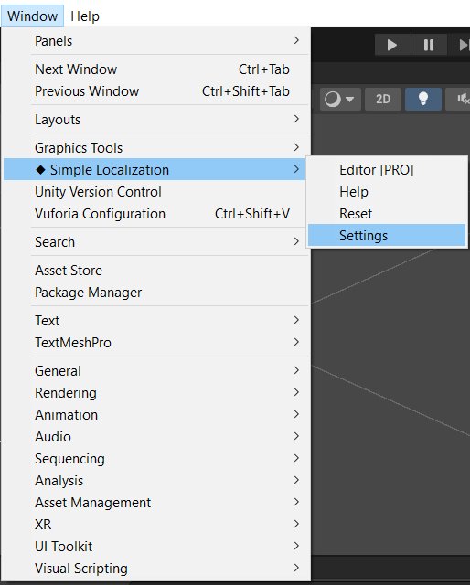
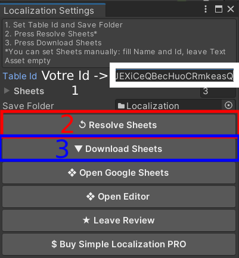

# Ajout d'un paquet permettant de changer la langue de l'application

***

## Installation du paquet Simple Localization with Google Sheets

Pour commencer, ouvrez votre projet Unity si ce n'est pas déjà fait. Ensuite, ouvrez une page internet et collez le lien suivant : [https://assetstore.unity.com/packages/tools/gui/simple-localization-with-google-sheets-120113](https://assetstore.unity.com/packages/tools/gui/simple-localization-with-google-sheets-120113)

Cliquez sur `Add to My Assets` 

<figure markdown="span">
    
    <figcaption>Page du paquet de localisation</figcaption>
</figure>

Pour continuer, vous devrez vous connecter à votre compte Unity. Une fois la connexion terminée, vous allez être redirigé à nouveau vers la page du paquet. Cliquez sur `Open in Unity`.

<figure markdown="span">
    
    <figcaption>Page du paquet de localisation</figcaption>
</figure>

Une fenêtre devrait s'ouvrir en haut de votre page vous demander d'autoriser l'accès à Unity. Cliquez sur `Ok`.
De retour sur unity, une fenêtre nommée **Package Manager** a du s'ouvrir. Sélectionnez le bon paquet et cliquez sur `Download`.
Une fois le paquet téléchargé, cliquez sur `Import`.

<figure markdown="span">
    
    <figcaption>Fenêtre du Package Manager</figcaption>
</figure>

Une nouvelle fenêtre devrait également s'ouvrir avec les information du paquet. Cliquez à nouveau sur `import`.

<figure markdown="span">
    
    <figcaption>Fenêtre d'import du paquet</figcaption>
</figure>

Maintenant, vous pouvez vous rendre dans le dossier `SimpleLocalization`, puis ouvrir la scène `Example`. Si le paquet est importé correctement, l'exemple devrait fonctionner.

<figure markdown="span">
    
    <figcaption>Chemin d'accès à la scène d'exemple.</figcaption>
</figure>

## Personnaliser les textes en fonction de la langue

Maintenant que nous avons installé le paquet, nous pouvons passer à la personnalisation des textes que nous voulons traduire.
Pour cela, il faut créer un document Google Sheets. Si vous ne savez pas utiliser Google Sheets, de l'aide est disponible [ici](https://support.google.com/docs/answer/6000292?hl=fr&co=GENIE.Platform%3DDesktop)

Dans le cadre de notre projet, nous utiliserons le document suivant : [Lien vers le document](https://docs.google.com/spreadsheets/d/1xfL971gDXXS4rqXUoYytgwJEXiCeQBecHuoCRmkeasQ/edit#gid=0).

Comme vous pouvez le voir, il y a une certaine mise en forme à respecter. Dans la colonne A, il faut renseigner les clés qui nous servirons de références dans l'éditeur. Dans la ligne 1, vous devez renseigner Key en A1, puis les langues que vous voulez implémenter dans votre projet. 

<figure markdown="span">
    
    <figcaption>Exemple de document valide.</figcaption>
</figure>

Une fois que vous avez rempli le document avec les valeurs que vous souhaitez, cliquez sur `Partager`.

<figure markdown="span">
    
    <figcaption>Page Google Sheets contenant le bouton partager</figcaption>
</figure>

Ensuite, dans Accès général, cliquez sur `Limité` pour le remplacer par `Tous les utilisateurs qui ont le lien`. Passez ces utilisateurs en `Lecteur`.

<figure markdown="span">
    
    <figcaption>Gestion des accès</figcaption>
</figure>

Maintenant, il vous faut l'identifiant du document. Pour cela, récupérez la suite de caractères qui se situe entre d/ et /edit et copiez-la. 

<figure markdown="span">
    
    <figcaption>Partie du lien à copier</figcaption>
</figure>

Retournez sur Unity. allez dans `Window > Simple Localization > Settings`.

<figure markdown="span">
    
    <figcaption>Option à sélectionner</figcaption>
</figure>

Dans la fenêtre qui s'ouvre, collez votre Id dans `Table Id`, puis cliquez sur `Reseolve Sheets`. Enfin, après le chargement terminé, sur `Download Sheets`.

<figure markdown="span">
    
    <figcaption>Paramètres à rentrer</figcaption>
</figure>

!!!info

    Guide d'installation vidéo :

    <iframe width="100%" height="415" src="https://www.youtube.com/embed/m139Reb3hmQ?si=joLUBfh4QGVSE_zf" title="YouTube video player" frameborder="0" allow="accelerometer; autoplay; clipboard-write; encrypted-media; gyroscope; picture-in-picture; web-share" allowfullscreen></iframe>