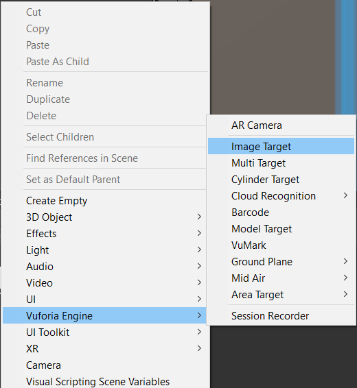
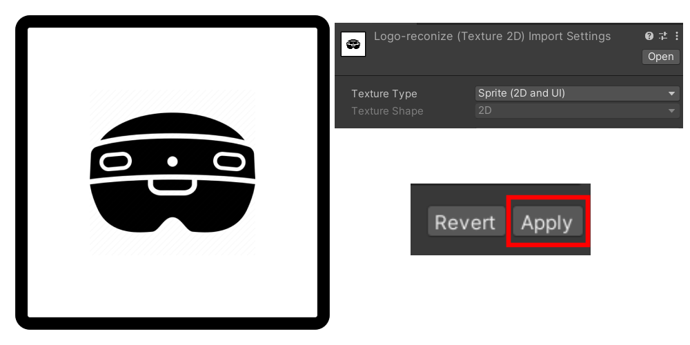
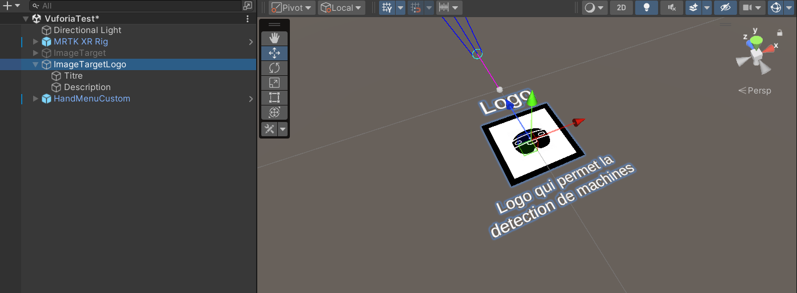
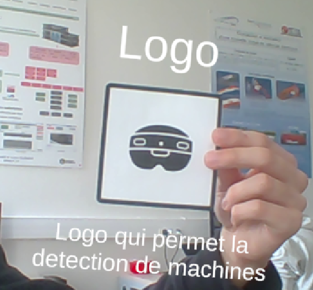

# Utiliser Vuforia avec Unity

    Cette partie est en cours d'écriture

***

## Introduction

Pour pouvoir intéragir avec des objets réels, nous avons plusieurs possibilités. 

La première est une cible image (ou Image Target en anglais). Il s'agit d'une cible qui se crée en fonction d'une image. Par exemple, à partir d'un logo ou d'une étiquette, vous pouvez placer un modèle 3D au bon emplacement.

La seconde possibilité est l'utilisation d'une cible de modèle (ou Model Target en anglais). Il s'agit d'une cible qui se crée en fonction d'un modèle 3D. Par exemple, si vous voulez détecter un objet et que vous en avez le modèle en 3D, vous pouvez rajouter des éléments qui se mettront automatiquement autour de l'objet.

Nous allons vous montrer comment les utiliser dans le cadre de notre projet.
Assurez-vous d'avoir déjà suivi les étapes présentes sur la page d'[Installation de Vuforia](\configuration\vuforia).

## Utiliser une cible d'image (Image Target)

Pour utiliser une cible d'image, faites un clique droit dans la hiérarchie de votre scène puis cliquez sur `Vuforia Engine > Image Target`.

<figure markdown="span">
    
    <figcaption>Menu de contexte de la scène</figcaption>
</figure>

Ensuite importez l'image que vous voulez suivre dans unity. Dans notre cas, nous utiliserons le logo suivant. Changer le type de texture en `Sprite (2D and UI)`. Cliquez ensuite sur `Apply`.

<figure markdown="span">
    
    <figcaption>Menu de contexte de la scène</figcaption>
</figure>

Cliquez sur l'élément `ImageTarget` présent dans votre scène. Dans le script `Image Target Behaviour`, glissez votre image. Cliquez sur advanced et renseignez la taille physique (en mètres) de votre objet.

<figure markdown="span">
    
    <figcaption>Composant Image Target Behaviour de l'Image Target</figcaption>
</figure>

Vous pouvez ensuite ajouter les éléments que vous voulez montrer quand l'image apparait sur la caméra. Pour faire cela, placez ces éléments enfant de l'Image Target. 

<figure markdown="span">
    
    <figcaption>Exemple d'Image Target sur Unity</figcaption>
</figure>

<figure markdown="span">
    
    <figcaption>Exemple d'Image Target avec un téléphone</figcaption>
</figure>

## Utiliser une cible de modèle (Model Target)